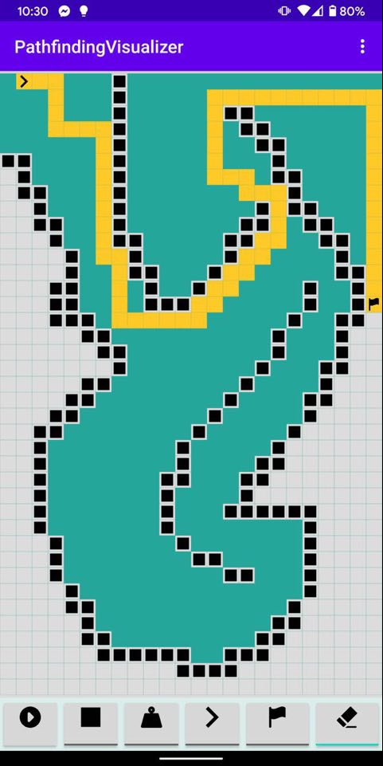

# PathfindingVisualizer

Ez a repository az Android alapú szoftverfejlesztés c. tárgyamhoz leadott nagy házi feladatomat tartalmazza. 

A projekt egy androidon futó gráf algoritmusokat vizualizáló alkalmazást valósít meg. Falakat és súlyokat különöböztetek meg, a súlyokon egyel nehezebb továbbhaladni mint az üres mezőkön.
A kirajzolt útvonal le van mentve perzisztensen hogy ne kelljen újra rajzolni a pályát. 

Egy screenshot a futó alkalmazásról:

</img>
